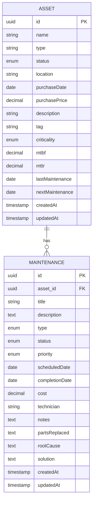
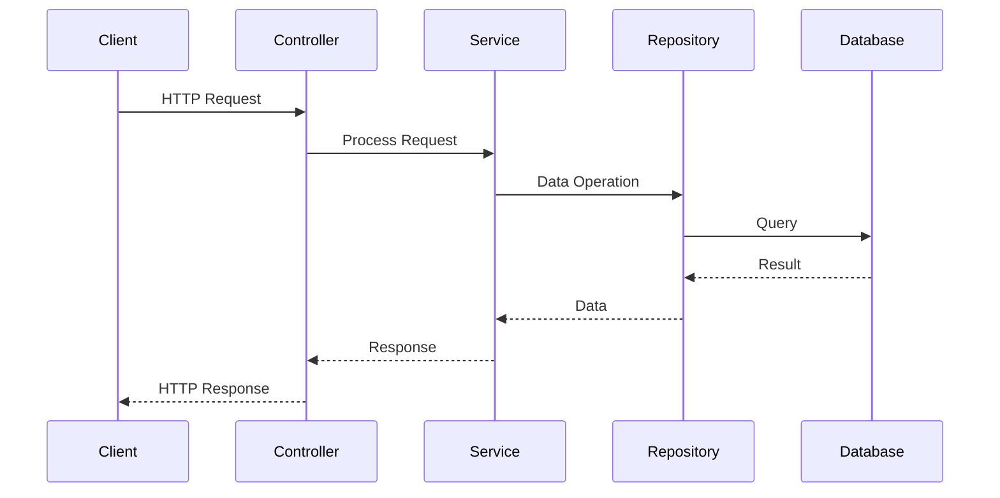

# Asset Guardian CRM

Sistema de Gestão de Manutenção de Ativos Industriais

## 📋 Documentação

### 📊 MER (Modelo Entidade-Relacionamento)



### 🏗️ Arquitetura

O projeto segue uma arquitetura em camadas com os seguintes padrões:

1. **Clean Architecture**
   - Entities (Core)
   - Use Cases (Application)
   - Interface Adapters (Infrastructure)
   - Frameworks & Drivers (External)

2. **Repository Pattern**
   - Abstração da camada de dados
   - Implementação específica para PostgreSQL

3. **Service Layer Pattern**
   - Lógica de negócios isolada
   - Injeção de dependências

4. **Factory Pattern**
   - Criação de objetos complexos
   - Encapsulamento da lógica de criação

### 🔄 Fluxo de Dados



### 📡 Endpoints da API

#### Assets

| Método | Endpoint | Descrição |
|--------|----------|-----------|
| GET | /api/assets | Lista todos os ativos |
| GET | /api/assets/:id | Obtém um ativo específico |
| POST | /api/assets | Cria um novo ativo |
| PUT | /api/assets/:id | Atualiza um ativo |
| DELETE | /api/assets/:id | Remove um ativo |

#### Maintenance

| Método | Endpoint | Descrição |
|--------|----------|-----------|
| GET | /api/maintenance | Lista todas as manutenções |
| GET | /api/maintenance/:id | Obtém uma manutenção específica |
| POST | /api/maintenance | Cria uma nova manutenção |
| PUT | /api/maintenance/:id | Atualiza uma manutenção |
| DELETE | /api/maintenance/:id | Remove uma manutenção |

### 🛠️ Tecnologias Utilizadas

#### Backend
- Node.js
- TypeScript
- Express
- TypeORM
- PostgreSQL
- Jest (Testes)
- Docker

#### Frontend
- React
- TypeScript
- Material-UI
- Vite
- Tailwind CSS
- React Query
- Jest + React Testing Library

### 📦 Estrutura do Projeto

```
├── backend/
│   ├── src/
│   │   ├── core/           # Entidades e regras de negócio
│   │   ├── application/    # Casos de uso
│   │   ├── infrastructure/ # Implementações concretas
│   │   └── interfaces/     # Controllers e rotas
│   ├── tests/             # Testes unitários e de integração
│   └── migrations/        # Migrações do banco de dados
│
└── frontend/
    ├── src/
    │   ├── components/    # Componentes React
    │   ├── hooks/        # Custom hooks
    │   ├── services/     # Serviços de API
    │   ├── store/        # Gerenciamento de estado
    │   └── utils/        # Funções utilitárias
    └── tests/            # Testes unitários
```

### 🚀 Como Executar

1. Clone o repositório
2. Configure as variáveis de ambiente
3. Execute as migrações do banco de dados
4. Inicie o backend e frontend

```bash
# Backend
cd backend
npm install
npm run migration:run
npm run dev

# Frontend
cd frontend
npm install
npm run dev
```

### 🧪 Testes

```bash
# Backend
npm run test

# Frontend
npm run test
```

### 📝 Convenções de Código

- ESLint para linting
- Prettier para formatação
- Conventional Commits
- Git Flow

### 🔒 Segurança

- Autenticação JWT
- Validação de dados
- Sanitização de inputs
- Rate limiting
- CORS configurado

### 📈 Monitoramento

- Logs estruturados
- Métricas de performance
- Rastreamento de erros
- Health checks

### 🔄 CI/CD

- GitHub Actions
- Testes automatizados
- Deploy automático
- Versionamento semântico

## Project info

**URL**: https://lovable.dev/projects/a394ddc1-d6fc-439b-ad53-08847a1ff2d2

## How can I edit this code?

There are several ways of editing your application.

**Use Lovable**

Simply visit the [Lovable Project](https://lovable.dev/projects/a394ddc1-d6fc-439b-ad53-08847a1ff2d2) and start prompting.

Changes made via Lovable will be committed automatically to this repo.

**Use your preferred IDE**

If you want to work locally using your own IDE, you can clone this repo and push changes. Pushed changes will also be reflected in Lovable.

The only requirement is having Node.js & npm installed - [install with nvm](https://github.com/nvm-sh/nvm#installing-and-updating)

Follow these steps:

```sh
# Step 1: Clone the repository using the project's Git URL.
git clone <YOUR_GIT_URL>

# Step 2: Navigate to the project directory.
cd <YOUR_PROJECT_NAME>

# Step 3: Install the necessary dependencies.
npm i

# Step 4: Start the development server with auto-reloading and an instant preview.
npm run dev
```

**Edit a file directly in GitHub**

- Navigate to the desired file(s).
- Click the "Edit" button (pencil icon) at the top right of the file view.
- Make your changes and commit the changes.

**Use GitHub Codespaces**

- Navigate to the main page of your repository.
- Click on the "Code" button (green button) near the top right.
- Select the "Codespaces" tab.
- Click on "New codespace" to launch a new Codespace environment.
- Edit files directly within the Codespace and commit and push your changes once you're done.

## What technologies are used for this project?

This project is built with:

- Vite
- TypeScript
- React
- shadcn-ui
- Tailwind CSS

## How can I deploy this project?

Simply open [Lovable](https://lovable.dev/projects/a394ddc1-d6fc-439b-ad53-08847a1ff2d2) and click on Share -> Publish.

## Can I connect a custom domain to my Lovable project?

Yes, you can!

To connect a domain, navigate to Project > Settings > Domains and click Connect Domain.

Read more here: [Setting up a custom domain](https://docs.lovable.dev/tips-tricks/custom-domain#step-by-step-guide)
