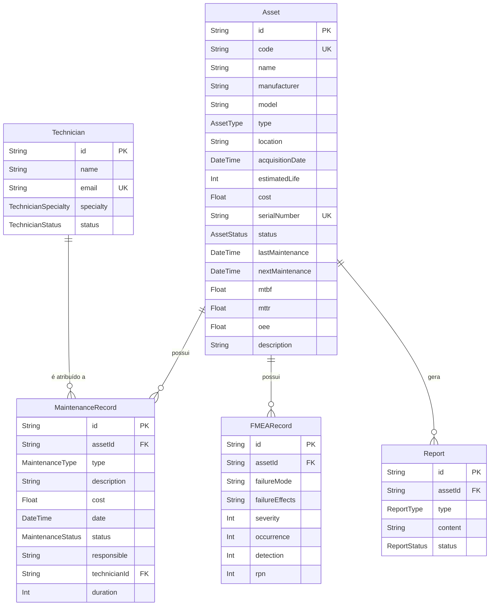

# Asset Guardian - CRM para Gestão de Manutenção

**Asset Guardian** é um sistema completo de CRM (Customer Relationship Management) focado na gestão de manutenção de ativos. Ele permite o controle detalhado de equipamentos, agendamento de manutenções, análise de falhas (FMEA), e o monitoramento de indicadores chave de performance (KPIs) como MTBF, MTTR e OEE.

O projeto é estruturado como um monorepo, contendo um backend em Node.js com Express e Prisma, e um frontend moderno em React com Vite e Material-UI.

## Sumário

- [Arquitetura](#arquitetura)
- [Diagrama de Entidade e Relacionamento (MER)](#diagrama-de-entidade-e-relacionamento-mer)
- [Tecnologias Utilizadas](#tecnologias-utilizadas)
  - [Backend](#backend)
  - [Frontend](#frontend)
  - [Banco de Dados](#banco-de-dados)
- [Como Rodar o Projeto](#como-rodar-o-projeto)
  - [Com Docker (Recomendado)](#com-docker-recomendado)
  - [Localmente](#localmente)
- [Estrutura de Diretórios](#estrutura-de-diretórios)
- [Futuras Melhorias](#futuras-melhorias)

## Arquitetura

O sistema adota uma arquitetura de microsserviços desacoplados, orquestrados com Docker Compose para facilitar o desenvolvimento e a implantação.

```mermaid
graph TD;
    subgraph "User's Browser"
        A[React Frontend] -->|HTTP Requests| B(Backend API);
    end

    subgraph "Server Infrastructure (Docker)"
        B -->|CRUD Operations| C(PostgreSQL Database);
        B -->|ORM| D(Prisma);
    end

    A -- "Serve componentes de UI" --> User;
    B[Express.js Server] -- "Processa a lógica de negócio" --> D;
    C -- "Persiste os dados" --> V(Volume pgdata);

    style A fill:#61DAFB,stroke:#fff,stroke-width:2px;
    style B fill:#339933,stroke:#fff,stroke-width:2px;
    style C fill:#336791,stroke:#fff,stroke-width:2px;
    style D fill:#2D3748,stroke:#fff,stroke-width:2px;
```



-   **Frontend**: Uma Single Page Application (SPA) construída com React e Vite, responsável pela interface do usuário.
-   **Backend**: Uma API RESTful desenvolvida com Node.js e Express, que gerencia toda a lógica de negócio e a comunicação com o banco de dados.
-   **Banco de Dados**: Um banco de dados PostgreSQL, que armazena todas as informações da aplicação.
-   **Prisma**: ORM utilizado no backend para abstrair e simplificar as operações com o banco de dados.

## Diagrama de Entidade e Relacionamento (MER)

O diagrama abaixo ilustra a estrutura do banco de dados e as relações entre as principais entidades do sistema.



## Tecnologias Utilizadas

### Backend

-   **Linguagem**: TypeScript
-   **Framework**: Node.js com Express.js
-   **ORM**: Prisma
-   **Banco de Dados**: PostgreSQL
-   **Testes**: Jest (a ser implementado)

### Frontend

-   **Linguagem**: TypeScript
-   **Framework**: React (com Vite)
-   **UI Library**: Material-UI (MUI)
-   **Roteamento**: React Router DOM
-   **Gráficos**: Recharts
-   **Requisições HTTP**: Axios

### Banco de Dados

-   **Sistema**: PostgreSQL 15

## Como Rodar o Projeto

### Com Docker (Recomendado)

A forma mais simples de executar o projeto é utilizando Docker e Docker Compose.

1.  **Clone o repositório:**
    ```bash
    git clone <URL_DO_REPOSITORIO>
    cd CRM-Gestao-da-Manutencao
    ```

2.  **Suba os contêineres:**
    ```bash
    docker-compose up --build
    ```

3.  **Acesse as aplicações:**
    -   Frontend: [http://localhost:3000](http://localhost:3000)
    -   Backend API: [http://localhost:4000](http://localhost:4000)

4.  **Para popular o banco de dados com dados iniciais (seeding):**
    ```bash
    docker-compose exec backend npm run seed
    ```

### Localmente

Para executar o projeto sem Docker, você precisará ter o Node.js e o PostgreSQL instalados em sua máquina.

1.  **Clone o repositório:**
    ```bash
    git clone <URL_DO_REPOSITORIO>
    cd CRM-Gestao-da-Manutencao
    ```

2.  **Setup do Backend:**
    ```bash
    cd backend
    npm install
    # Crie um arquivo .env com base no .env.example e configure a DATABASE_URL
    npx prisma migrate dev
    npx prisma db seed
    npm run dev
    ```

3.  **Setup do Frontend (em outro terminal):**
    ```bash
    cd frontend
    npm install
    # Crie um arquivo .env e configure a variável VITE_API_URL=http://localhost:4000
    npm run dev
    ```

## Estrutura de Diretórios

```
CRM-Gestao-da-Manutencao/
├── backend/
│   ├── prisma/         # Schema e migrações do banco de dados
│   └── src/
│       ├── controllers/  # Controladores da API
│       ├── routes/       # Definição das rotas
│       ├── services/     # Lógica de negócio
│       └── ...
├── frontend/
│   └── src/
│       ├── components/   # Componentes React reutilizáveis
│       ├── hooks/        # Hooks customizados
│       ├── pages/        # Páginas da aplicação
│       ├── services/     # Serviços de API
│       └── ...
└── docker-compose.yml    # Orquestração dos contêineres
```

## Futuras Melhorias

O projeto está em desenvolvimento contínuo. Algumas das funcionalidades e melhorias planejadas para o futuro incluem:

-   **Autenticação e Autorização**: Implementar um sistema de login com diferentes níveis de permissão (e.g., administrador, técnico, gestor).
-   **Testes Unitários e de Integração**: Aumentar a cobertura de testes no backend e frontend para garantir a estabilidade e a qualidade do código.
-   **CI/CD Pipeline**: Configurar um pipeline de integração e entrega contínua (e.g., com GitHub Actions) para automatizar o build, teste e deploy.
-   **Cálculos de KPI Avançados**: Permitir que os usuários configurem os parâmetros para o cálculo de OEE (performance, qualidade) em vez de usar valores fixos.
-   **Notificações em Tempo Real**: Enviar notificações sobre manutenções agendadas, atrasadas ou concluídas (e.g., via WebSockets ou e-mail).
-   **Gestão de Estoque de Materiais**: Melhorar o módulo de materiais para incluir controle de estoque mínimo e alertas de reposição.
-   **Internacionalização (i18n)**: Adicionar suporte para múltiplos idiomas na interface.
-   **Documentação da API**: Gerar documentação interativa para a API (e.g., com Swagger/OpenAPI).
